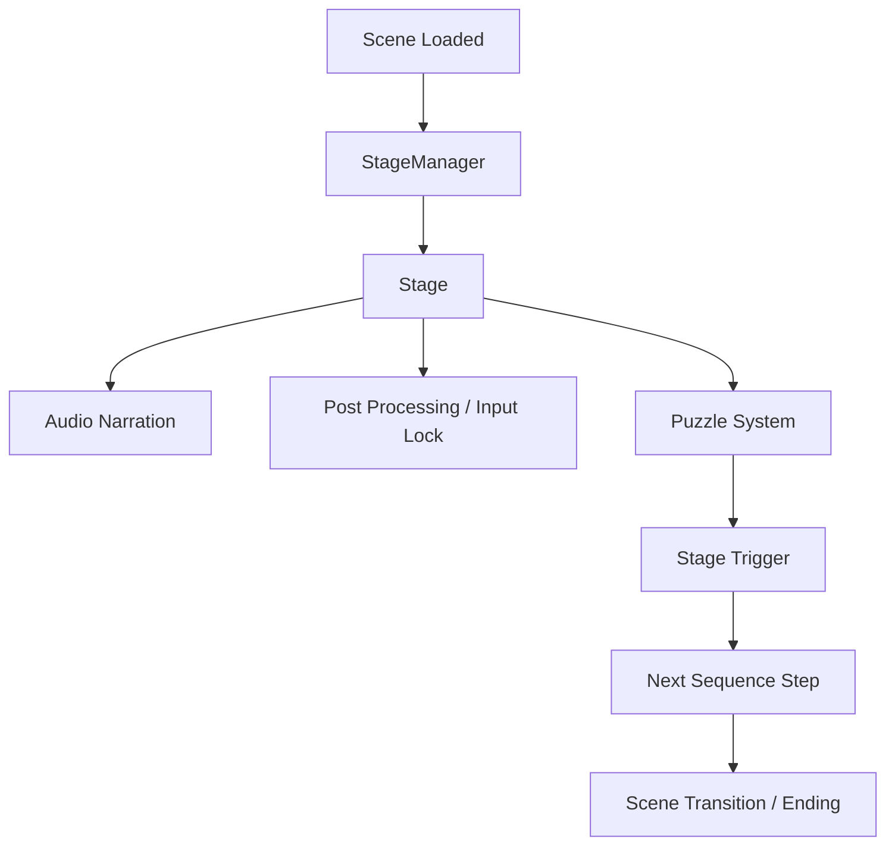

# Architecture Overview

DualMind는 내레이션 중심의 1인칭 퍼즐 게임입니다. 핵심은 스토리 진행, 입력 가능 상태, 화면 전환, 퍼즐 트리거, 씬 전환을 흩어지지 않게 연결하는 것입니다.

이 문서는 전체 구조를 빠르게 파악하기 위한 요약입니다. 면접에서 설명할 수 있는 문제 해결 흐름은 각 시스템 문서에 더 자세히 정리했습니다.

## High-Level Flow

## Core Systems

| System | Summary | Detail |
|---|---|---|
| Stage Sequence | 내레이션, 입력, 화면 전환, 퍼즐 완료 타이밍을 코루틴 흐름으로 통합 | [Stage Sequence](systems/stage-sequence.md) |
| Brain Maze | DFS로 미로를 만들고 BFS로 가장 먼 목표 지점을 선택 | [Brain Maze](systems/brain-maze.md) |
| Personality Switching | 두 인격 전환 시 Player, Camera, AudioListener, Interaction 기준을 함께 전환 | [Personality Switching](systems/personality-switching.md) |
| Pulse Scan | 구형 탐지는 PulseWave가 담당하고, 반응은 IPulseReactive 구현체가 담당 | [Pulse Scan](systems/pulse-scan.md) |
| Audio Narration | SoundManager/PoolManager를 통해 내레이션 중심 진행을 Stage와 연결 | [Audio Narration](systems/audio-narration.md) |

## Class Relationship

전체 클래스 관계는 [Class Diagram](class-diagram.md)에서 확인할 수 있습니다.

## Design Intent

DualMind의 구조는 완성형 프레임워크라기보다, 짧은 기간 안에 내레이션 기반 플레이 경험을 성립시키기 위해 책임을 나눈 결과입니다.

- `Stage`: 스토리 진행과 Trigger 대기
- `MazeGenerator`: 절차적 미로와 목표 배치
- `PersonalityManager`: 두 인격 전환 상태 관리
- `PulseWave`: 스캔 탐지
- `IPulseReactive`: 퍼즐 오브젝트 반응 확장점
- `SoundManager` / `PoolManager`: 내레이션과 오디오 재생

## Improvement Direction

구현 당시 한계와 리팩토링 방향은 [Improvement Notes](improvements.md)에 정리했습니다.
