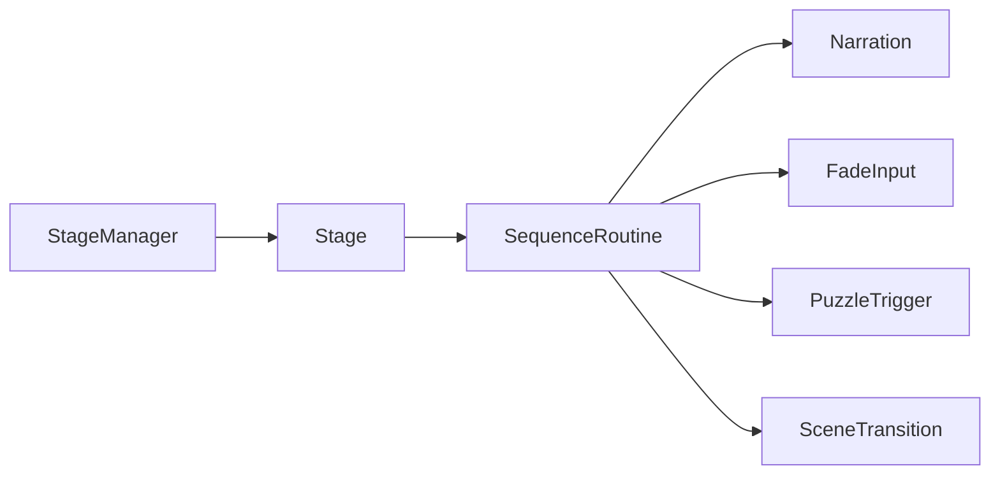
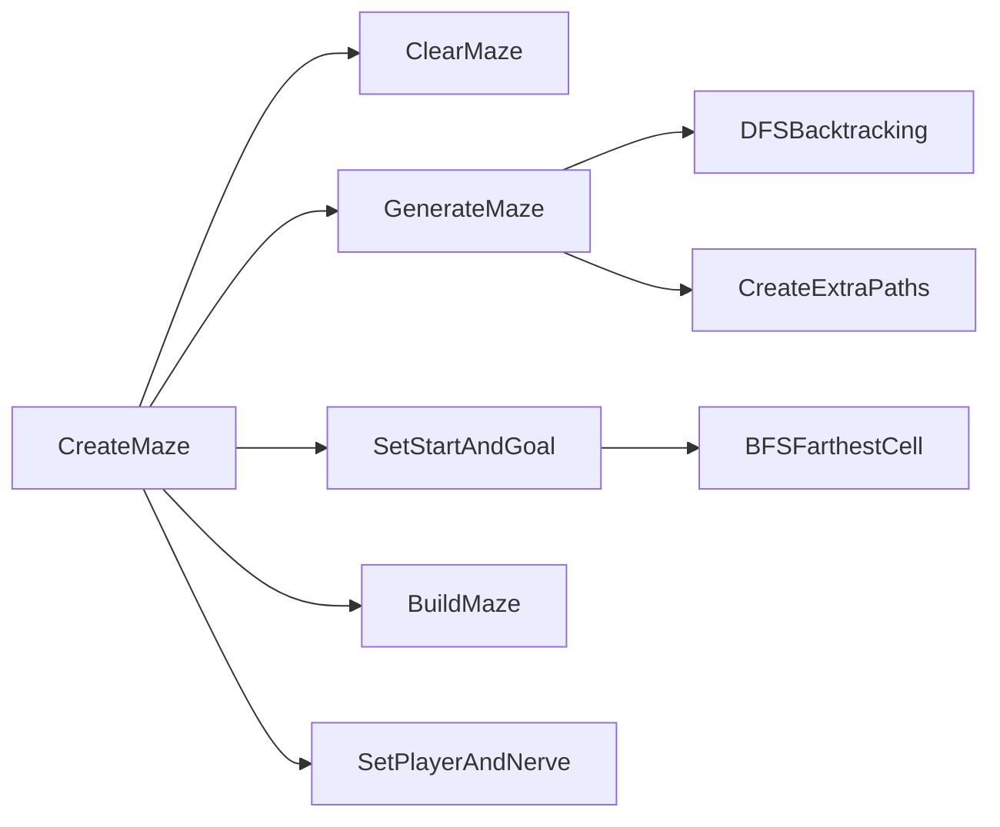
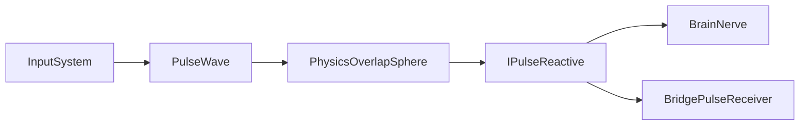

# Architecture Overview

DualMind는 내레이션 중심의 1인칭 퍼즐 게임입니다. 핵심은 스토리 진행, 입력 가능 상태, 화면 전환, 퍼즐 트리거, 씬 전환을 흩어지지 않게 연결하는 것입니다.

## 1. Stage Sequence System

### Problem

내레이션이 끝나는 시점, 화면 암전/개안, 입력 잠금, 퍼즐 완료, 다음 씬 이동이 서로 다른 스크립트에 흩어지면 진행 순서가 꼬일 수 있습니다.

### Solution

`Stage` 추상 클래스를 기반으로 각 스테이지가 `SequenceRoutine()`을 구현합니다. 공통 기능은 `Stage`가 제공하고, 실제 스토리 흐름은 `Intro`, `Stage1`, `Stage2`, `Stage3`, Ending 클래스가 코루틴으로 구성합니다.

### Implementation

- `StageManager`: 씬 로드 후 현재 Stage 탐색 및 시작
- `Stage`: 내레이션, 입력 제어, Trigger 대기 공통 기능 제공
- `GameManager`: 다음 스테이지 로드와 퀘스트 클리어 카운트 관리

## 2. Brain Maze System

### Problem

고정된 미로는 반복 플레이와 감정 단계별 변화를 보여주기 어렵습니다.

### Solution

`MazeGenerator`가 DFS 백트래킹으로 미로를 생성하고, BFS로 시작점에서 가장 먼 도달 가능 셀을 목표 지점으로 선택합니다.

### Implementation

## 3. Personality Switching System

### Problem

두 인격을 전환할 때 단순히 플레이어 오브젝트만 바꾸면 카메라, 오디오 리스너, 입력 상태, 상호작용 기준 카메라가 엇갈릴 수 있습니다.

### Solution

`PersonalityManager`가 현재 인격 인덱스를 관리하고, 전환 시 `PlayerController`, `Camera`, `AudioListener`, `InteractionManager`의 기준 카메라를 함께 갱신합니다. `PostProcessingControl`은 전환 이벤트를 받아 화면 페이드를 처리합니다.

## 4. Pulse Scan Interaction System

### Problem

보이지 않는 퍼즐 정보를 플레이어가 스캔으로 찾아내는 구조가 필요했습니다. 동시에 스캔 시스템이 특정 퍼즐 클래스에 강하게 의존하면 확장이 어려워집니다.

### Solution

`PulseWave`는 구형 범위 탐지만 담당하고, 실제 반응은 `IPulseReactive` 구현체가 처리합니다.

