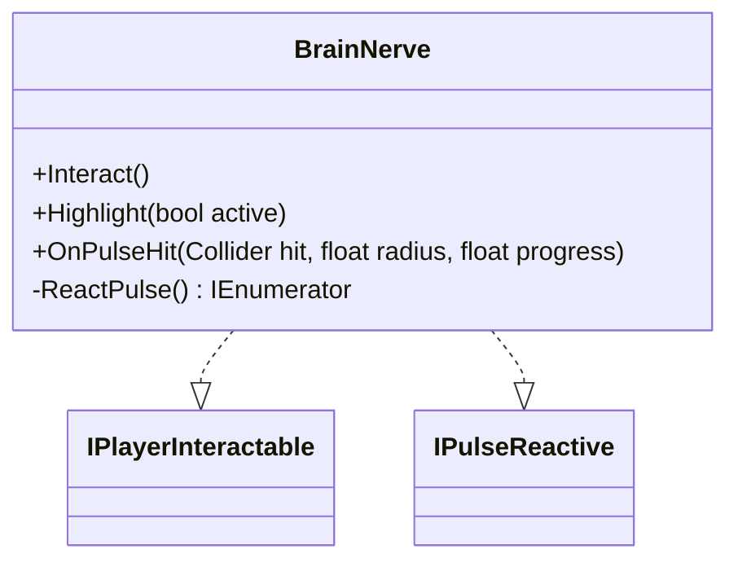

# BrainNerve

Source: [`BrainNerve.cs`](../../src/Assets/Scripts/Puzzle/BrainConnect/BrainNerve.cs)

## Role

Brain Maze의 목표 오브젝트입니다. 플레이어 상호작용과 Pulse 반응을 모두 처리합니다.

## Interfaces

- `IPlayerInteractable`: 플레이어가 직접 상호작용 가능
- `IPulseReactive`: Pulse Scan에 반응 가능

## Key Behavior

- `Interact()`: 현재 Stage Trigger 호출 및 Count 증가
- `OnPulseHit()`: Pulse에 반응해 일정 시간 목표 색상 표시
- `ReactPulse()`: 색상 표시 후 BASIC으로 복귀
