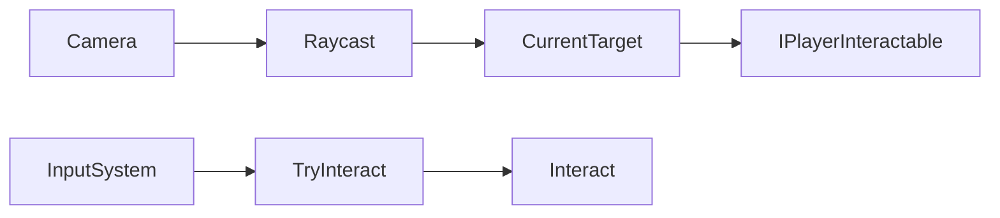

# InteractionManager

Source: [`InteractionManager.cs`](../../src/Assets/Scripts/Systems/Interaction/InteractionManager.cs)

## Role

현재 카메라 기준으로 화면 중앙 Raycast를 쏘고, 상호작용 가능한 오브젝트를 감지합니다.

## Problem

두 인격 전환이 있는 구조에서는 현재 활성 카메라가 바뀌므로, 상호작용 기준 카메라도 함께 갱신되어야 합니다.

## Solution

`PersonalityManager`가 활성 카메라를 바꿀 때 `InteractionManager.SetCam()`을 호출합니다. `InteractionManager`는 현재 카메라 기준으로 대상 탐지와 Highlight를 관리합니다.

## Key Methods

- `SetCam(Camera camera)`: 현재 상호작용 기준 카메라 변경
- `UpdateInteractable()`: Raycast로 대상 탐지
- `TryInteract()`: 현재 대상의 `Interact()` 호출
