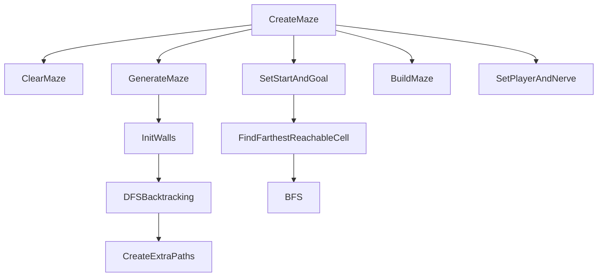

# MazeGenerator

Source: [`MazeGenerator.cs`](../../src/Assets/Scripts/Puzzle/BrainConnect/MazeGenerator.cs)

## Role

Brain Maze 퍼즐의 미로를 절차적으로 생성하고, 플레이어 시작점과 목표 지점을 배치합니다.

## Problem

고정 미로는 반복성이 낮고, 감정 단계별 퍼즐 진행의 변화를 보여주기 어렵습니다. 또한 목표 지점이 너무 가까우면 미로를 푸는 의미가 약해집니다.

## Solution

DFS 백트래킹으로 미로를 생성하고, BFS 탐색으로 시작점에서 가장 먼 도달 가능 셀을 목표 지점으로 선택합니다.

## Key Methods

- `CreateMaze(ColorType type)`: 전체 생성 흐름의 진입점
- `GenerateMaze()`: DFS 백트래킹 기반 미로 생성
- `CreateExtraPaths()`: 일정 확률로 추가 길 생성
- `FindFarthestReachableCell()`: BFS로 가장 먼 목표 지점 탐색
- `SetPlayerAndNerve()`: 플레이어 위치와 목표 오브젝트 배치

## Portfolio Point

절차 생성 알고리즘을 단순히 적용한 것이 아니라, 퍼즐 동선 길이와 감정 테마 목표 배치까지 연결했습니다.
