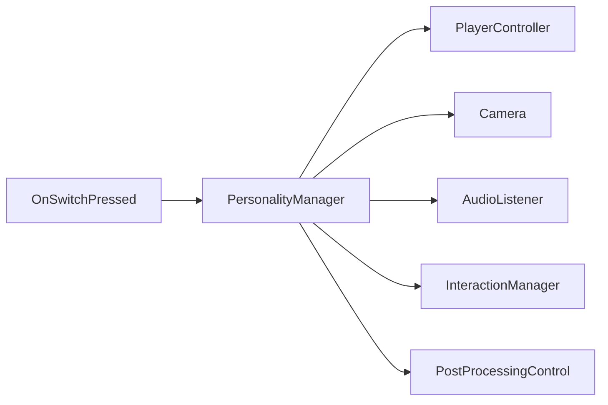

# PersonalityManager

Source: [`PersonalityManager.cs`](../../src/Assets/Scripts/Systems/Player/Personality/PersonalityManager.cs)

## Role

두 인격 전환을 관리합니다. 플레이어 컨트롤러, 카메라, AudioListener, 상호작용 기준 카메라를 함께 전환합니다.

## Problem

플레이어 오브젝트만 바꾸면 카메라, 입력, 오디오 리스너, 상호작용 Raycast 기준이 서로 어긋날 수 있습니다.

## Solution

현재 인격 인덱스를 기준으로 활성 플레이어와 비활성 플레이어를 나누고, 전환 이벤트를 통해 화면 페이드와 이동 가능 상태를 연결했습니다.

## Key Methods

- `SwitchToPlayer(int index)`: 전환 코루틴
- `SetPlayerActivate(Player, bool)`: Player/Camera/AudioListener 동시 제어
- `IsMainPersonality()`: 현재 인격 확인
- `SetCamerasOn()`, `SetPlayerOff()`: Stage3 등 특수 연출용 상태 제어
