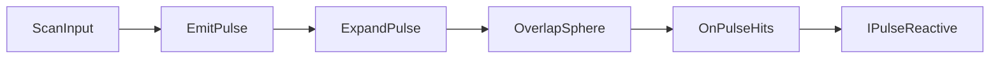

# PulseWave

Source: [`PulseWave.cs`](../../src/Assets/Scripts/Systems/Pulse/PulseWave.cs)

## Role

Pulse Scan 입력을 받아 구형 탐지 범위를 확장하고, 감지된 Collider를 이벤트로 전달합니다.

## Problem

스캔 기능이 특정 퍼즐 오브젝트를 직접 알고 있으면 새로운 퍼즐 반응을 추가할 때 Pulse 시스템을 계속 수정해야 합니다.

## Solution

`PulseWave`는 탐지만 담당하고, 반응은 `IPulseReactive` 구현체가 담당하도록 분리했습니다.

## Key Methods

- `EmitPulse()`: 스캔 시작
- `ExpandPulse()`: 범위를 점진적으로 확장
- `OnPulseHits`: 감지된 Collider 전달 이벤트

## Implementation Note

`HashSet<int>`로 이미 반응한 오브젝트를 기록해 같은 Pulse 안에서 중복 반응을 방지합니다.
