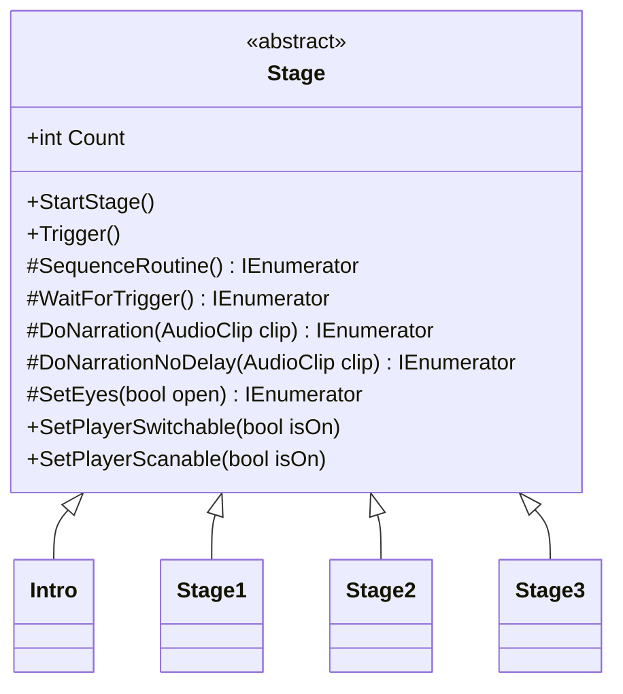

# Stage

Source: [`Stage.cs`](../../src/Assets/Scripts/Core/Stage/Stage.cs)

## Role

스테이지 진행의 공통 기반 클래스입니다. 내레이션 재생, 입력 제어, 화면 전환, 퍼즐 Trigger 대기를 공통 기능으로 제공합니다.

## Problem

각 스테이지가 내레이션, 입력 잠금, 화면 암전, 퍼즐 완료 대기를 제각각 구현하면 진행 흐름이 흩어지고 유지보수가 어려워집니다.

## Solution

`Stage`는 `SequenceRoutine()`이라는 추상 코루틴을 강제하고, 스테이지별 클래스는 이 루틴 안에서 자신만의 진행 순서를 작성합니다.

## Key Methods

- `StartStage()`: `SequenceRoutine()` 실행 시작
- `WaitForTrigger()`: 퍼즐 완료 또는 외부 이벤트까지 대기
- `Trigger()`: 대기 중인 시퀀스를 다음 단계로 진행
- `DoNarration()`: 오디오 클립 길이만큼 진행 대기
- `SetEyes()`: 화면 페이드와 입력 가능 상태를 함께 제어

## Used By

- [Intro](../../src/Assets/Scripts/Stage/Intro.cs)
- [Stage1](Stage1.md)
- [Stage2](../../src/Assets/Scripts/Stage/Stage2.cs)
- [Stage3](../../src/Assets/Scripts/Stage/Stage3.cs)
