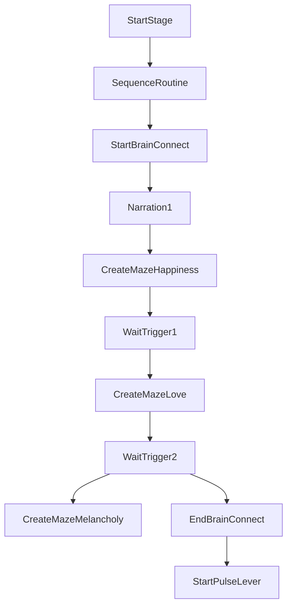

# Stage1

Source: [`Stage1.cs`](../../src/Assets/Scripts/Stage/Stage1.cs)

## Role

Brain Maze 퍼즐과 Pulse Lever 퍼즐을 순차 진행하는 스테이지 클래스입니다.

## Problem

Stage1은 여러 감정 테마의 미로를 반복 생성하고, 내레이션과 입력 가능 상태를 맞추며, 퍼즐 완료 Trigger를 기다려야 합니다.

## Solution

`StartBrainConnect()`에서 감정별 미로 생성과 내레이션, 화면 전환, Trigger 대기를 순서대로 배치했습니다.

## Key Collaborators

- [Stage](Stage.md)
- [MazeGenerator](MazeGenerator.md)
- [PersonalityManager](PersonalityManager.md)
- [PostProcessingControl](PostProcessingControl.md)
- [GameManager](GameManager.md)
