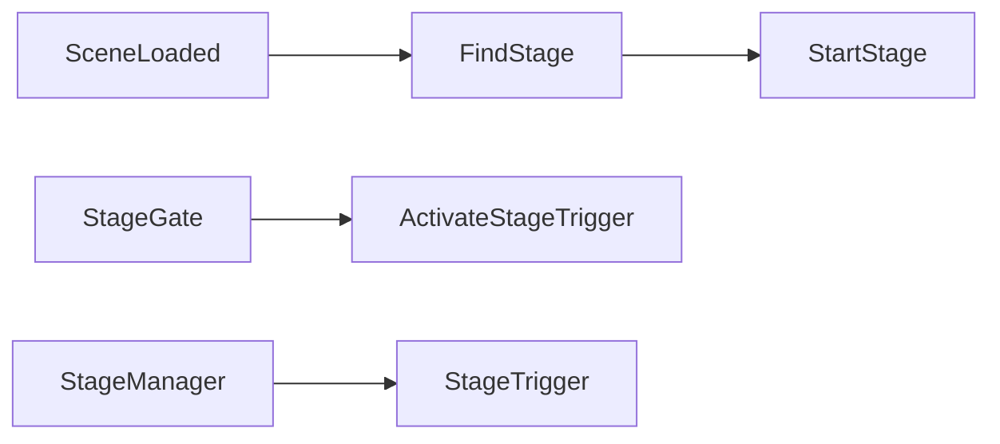

# StageManager

Source: [`StageManager.cs`](../../src/Assets/Scripts/Core/Managers/StageManager.cs)

## Role

씬이 로드될 때 현재 씬의 `Stage`를 찾아 시작합니다. 또한 Door 상태 변경 이벤트를 제공합니다.

## Key Methods

- `OnSceneLoaded()`: 현재 씬의 Stage 탐색 및 시작
- `ActivateStageTrigger()`: 현재 Stage Trigger 호출
- `SetDoor(int index, bool isOpen)`: Door 이벤트 발행
- `GetCurrentStage()`: 현재 Stage 반환
