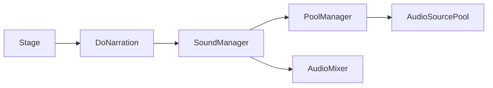

# Audio Narration Flow

Related classes: [SoundManager](../classes/SoundManager.md), [PoolManager](../classes/PoolManager.md), [Stage](../classes/Stage.md), [PostProcessingControl](../classes/PostProcessingControl.md)

## Problem

DualMind는 내레이션이 플레이 진행을 이끄는 구조입니다. 내레이션 재생과 Stage 진행이 따로 움직이면, 플레이어가 듣는 정보와 실제 입력 가능 상태가 어긋날 수 있습니다.

## What I Wanted

- Stage 시퀀스에서 내레이션 재생과 대기 시간을 직접 제어하고 싶었습니다.
- BGM, SFX, Narration 재생 진입점을 분리하고 싶었습니다.
- 반복 재생되는 오디오를 관리하기 쉽게 AudioSource 풀을 사용하고 싶었습니다.

## Solution

`Stage`는 `SoundManager.PlayNarration()`을 호출하고, AudioClip 길이만큼 대기합니다. `SoundManager`는 재생 요청의 진입점 역할을 하고, `PoolManager`가 실제 AudioSource를 재사용합니다.

## Implementation

- `Stage.DoNarration()`은 Clip을 재생하고 `clip.length` 기반으로 대기합니다.
- `SoundManager`는 BGM/SFX/Narration을 구분해 `PoolManager`로 전달합니다.
- `PoolManager`는 용도별 AudioSource 풀을 만들고, 사용 가능한 Source를 찾아 재생합니다.
- `SoundManager.SetDoctorVoice()`와 `SetMentalVoice()`는 AudioMixer Snapshot 전환을 담당합니다.

## Result

내레이션 중심 진행에서 오디오 재생과 Stage 시퀀스를 직접 연결할 수 있었고, BGM/SFX/Narration 재생 책임도 분리할 수 있었습니다.

## What I Would Improve

- 내레이션 대기 방식은 `clip.length`에 의존하므로, 스킵/중단/자막과 연결하려면 별도 NarrationController가 필요합니다.
- SoundLibrary의 Clip 필드는 많아질수록 관리가 어려워질 수 있어 Stage별 데이터 구조로 분리할 수 있습니다.
- AudioSource 풀링은 현재 간단한 구조이므로, 재생 우선순위나 중복 재생 정책을 추가할 수 있습니다.
