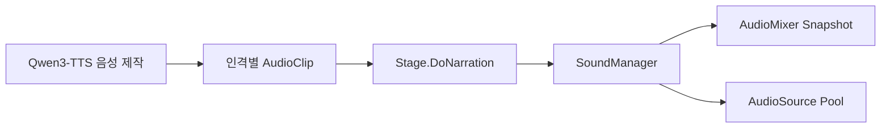

# 인격 전환 나레이션 음성 연출

관련 클래스: [Stage](../classes/Stage.md), [SoundManager](../classes/SoundManager.md), [PoolManager](../classes/PoolManager.md), [PostProcessingControl](../classes/PostProcessingControl.md)

## 상황

DualMind의 주인격과 보조 인격은 같은 공간을 다른 방식으로 해석합니다. 화면 효과와 텍스트만으로 전환을 표현하면, 플레이어가 보조 인격의 개입을 기능 변화로만 받아들일 수 있다고 봤습니다. 심상세계에서 내면의 목소리가 말을 거는 느낌을 나레이션으로 먼저 전달하고 싶었습니다.

## 판단

주인격은 밝은 톤, 보조 인격은 낮고 분노가 섞인 톤으로 구분했습니다. 보조 인격의 음성에는 에코를 더해 같은 공간의 일반적인 대화보다 내면에서 울리는 목소리에 가깝게 들리도록 했습니다.

## 제작과 적용

음성은 ComfyUI의 Qwen3-TTS로 제작했습니다. 이 과정은 Unity 코드와 별도의 콘텐츠 제작 단계입니다. Unity 쪽에서는 `Stage.DoNarration()`이 장면 순서에 맞춰 `SoundManager.PlayNarration()`을 호출하고, `SoundManager`가 Narration Mixer Group과 AudioMixer Snapshot 전환을 제공합니다. 실제 재생은 `PoolManager`의 AudioSource 풀을 사용합니다.

```mermaid
flowchart LR
    Voice[Qwen3-TTS 음성 제작] --> Clip[인격별 AudioClip]
    Clip --> Stage[Stage.DoNarration]
    Stage --> SoundManager
    SoundManager --> Mixer[AudioMixer Snapshot]
    SoundManager --> Pool[AudioSource Pool]
```

## 결과

인격 전환 뒤 보조 인격이 정보를 전달할 때, 목소리의 톤과 잔향이 먼저 분위기를 바꾸도록 했습니다. 플레이어가 내면의 목소리와 함께 퍼즐을 진행하는 느낌을 받도록 구성했고, 나레이션이 끝난 뒤에는 다음 퍼즐·입력 단계가 이어집니다.

## 자체 피드백

현재는 AudioClip 길이를 기준으로 진행을 대기합니다. 자막, 화면 효과, 음성 스킵을 함께 제어하려면 별도 나레이션 컨트롤러와 타임라인 기반 연출로 분리하는 편이 더 적절합니다.
