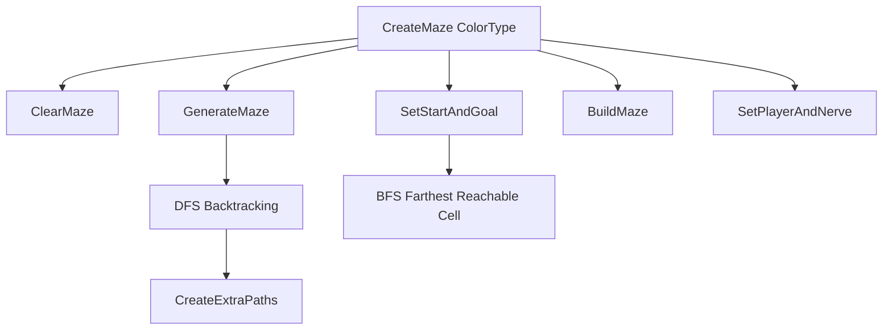

# Brain Maze System

Related classes: [MazeGenerator](../classes/MazeGenerator.md), [BrainNerve](../classes/BrainNerve.md), [Stage1](../classes/Stage1.md), [PostProcessingControl](../classes/PostProcessingControl.md)

## Problem

Brain Maze 퍼즐은 감정 테마별로 반복 진행되는 구조였습니다. 고정된 미로를 사용하면 플레이가 단조로워지고, 단계가 바뀌는 느낌도 약해집니다. 또한 목표 지점이 시작점과 너무 가까우면 미로를 탐색하는 의미가 줄어듭니다.

## What I Wanted

- 플레이할 때마다 미로 구조가 바뀌게 만들고 싶었습니다.
- 목표 지점은 시작점에서 충분히 멀리 배치하고 싶었습니다.
- 감정 테마에 따라 목표 오브젝트의 색상을 바꾸고 싶었습니다.
- 퍼즐이 진행될수록 미로 크기를 점진적으로 키워 난이도 상승을 보여주고 싶었습니다.

## Solution

`MazeGenerator`가 DFS 백트래킹으로 미로를 생성하고, BFS로 시작점에서 가장 먼 도달 가능 셀을 목표 지점으로 선택합니다.

## Implementation

- `GenerateMaze()`는 전체 배열을 벽으로 초기화한 뒤 DFS 백트래킹으로 길을 뚫습니다.
- `CreateExtraPaths()`는 일정 확률로 추가 길을 만들어 너무 단조로운 미로를 완화합니다.
- `FindFarthestReachableCell()`은 BFS로 시작점에서 가장 먼 도달 가능 셀을 찾습니다.
- `SetPlayerAndNerve()`는 플레이어를 시작 위치로 옮기고 목표 오브젝트를 목표 지점에 생성합니다.
- 감정 타입은 `ColorType`으로 전달되어 목표 오브젝트 색상에 반영됩니다.

## Result

Stage1에서 HAPPINESS, LOVE, MELANCHOLY, RAGE, FEAR 순서의 감정 테마 미로를 생성할 수 있었고, 미로 크기 증가와 목표 색상 변경을 통해 반복 구조에 변화를 줄 수 있었습니다.

## What I Would Improve

- 현재 미로 크기, 추가 길 확률, 제한 시간은 더 명확한 난이도 데이터로 분리할 수 있습니다.
- `DestroyImmediate` 사용은 런타임에서는 일반 `Destroy` 기반 풀링 구조로 바꾸는 것이 좋습니다.
- 미로 생성 결과를 디버그 뷰나 에디터 도구로 시각화하면 포트폴리오 설명력이 더 좋아집니다.
