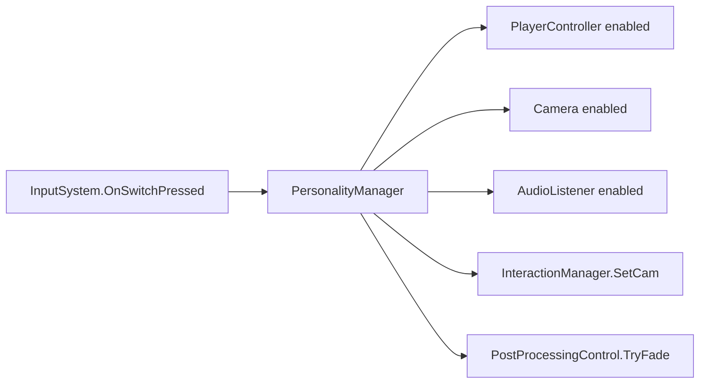

# Personality Switching System

Related classes: [PersonalityManager](../classes/PersonalityManager.md), [PlayerController](../../src/Assets/Scripts/Systems/Player/Controllers/PlayerController.cs), [InteractionManager](../classes/InteractionManager.md), [PostProcessingControl](../classes/PostProcessingControl.md)

## Problem

DualMind의 핵심 컨셉은 두 인격을 전환하며 진행하는 플레이입니다. 하지만 플레이어 오브젝트만 단순히 바꾸면 다음 상태들이 서로 어긋날 수 있습니다.

- 어떤 PlayerController가 입력을 받아야 하는가
- 어떤 Camera가 활성화되어야 하는가
- 어떤 AudioListener가 켜져야 하는가
- InteractionManager는 어떤 카메라 기준으로 Raycast를 쏴야 하는가
- 전환 중에는 입력을 막아야 하는가

## What I Wanted

- 인격 전환을 단순 오브젝트 교체가 아니라 하나의 플레이 경험으로 보이게 만들고 싶었습니다.
- 전환 중 화면 페이드를 넣어 자연스럽게 상태가 바뀌게 하고 싶었습니다.
- 입력, 카메라, 오디오, 상호작용 기준을 한 번에 맞추고 싶었습니다.

## Solution

`PersonalityManager`가 현재 인격 인덱스를 관리하고, 전환 시 Player, Camera, AudioListener, Interaction 기준 카메라를 함께 변경합니다. 전환 이벤트는 `PostProcessingControl`과 `PlayerController`가 구독해 페이드와 이동 가능 상태를 제어합니다.

## Implementation

- `InputSystem.OnSwitchPressed` 이벤트가 발생하면 `PersonalityManager`가 전환을 시작합니다.
- `SwitchToPlayer()` 코루틴은 전환 시간 동안 페이드를 처리하고 활성 플레이어를 바꿉니다.
- `SetPlayerActivate()`는 PlayerController, Camera, AudioListener를 같은 기준으로 켜고 끕니다.
- 활성 카메라가 바뀌면 `InteractionManager.SetCam()`으로 상호작용 기준도 갱신합니다.

## Result

두 인격 전환 시 조작 대상, 카메라, 오디오 리스너, 상호작용 Raycast 기준이 함께 바뀌게 되어 상태 불일치를 줄일 수 있었습니다.

## What I Would Improve

- 현재 플레이어 탐색은 Tag 기반이므로, 씬별 명시적 바인딩 또는 등록 구조로 바꿀 수 있습니다.
- `SwitchPersonality()`와 `SwitchToPlayer()`의 인덱스 관리 흐름은 더 명확하게 정리할 수 있습니다.
- 전환 가능 여부를 Stage 상태나 InputGate와 연결하면 더 안전합니다.
