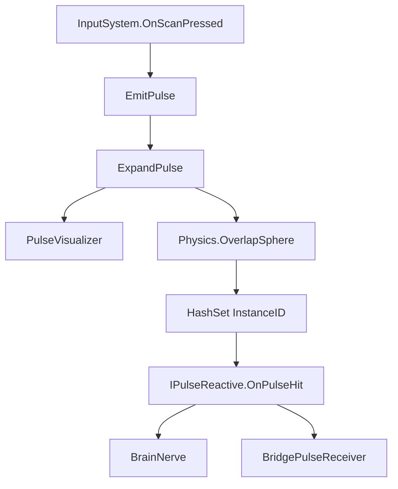

# Pulse Scan System

Related classes: [PulseWave](../classes/PulseWave.md), [BrainNerve](../classes/BrainNerve.md), [InteractionManager](../classes/InteractionManager.md), [IPulseReactive](../../src/Assets/Scripts/Interactable/Interfaces/IPulseReactive.cs)

## Problem

보이지 않는 퍼즐 정보를 플레이어가 스캔으로 찾아내는 구조가 필요했습니다. 하지만 Pulse 시스템이 특정 퍼즐 오브젝트를 직접 알고 있으면, 새로운 반응 오브젝트를 추가할 때마다 Pulse 코드를 수정해야 합니다.

## What I Wanted

- Pulse는 탐지만 담당하게 만들고 싶었습니다.
- 반응은 각 퍼즐 오브젝트가 스스로 처리하게 하고 싶었습니다.
- 같은 Pulse 안에서 동일 오브젝트가 여러 번 반응하지 않게 만들고 싶었습니다.

## Solution

`PulseWave`는 구형 범위 탐지를 수행하고, 감지된 오브젝트는 이벤트 또는 `IPulseReactive` 인터페이스를 통해 반응하도록 분리했습니다.

## Implementation

- `PulseWave.OnEnable()`에서 Scan 입력 이벤트를 구독합니다.
- `EmitPulse()`는 메인 인격이 아닐 때만 Pulse를 발생시킵니다.
- `ExpandPulse()`는 `scanProgress`를 증가시키며 탐지 반경을 키웁니다.
- `Physics.OverlapSphere()`로 범위 안의 Collider를 탐지합니다.
- `HashSet<int>`로 한 번 반응한 오브젝트를 기록합니다.

## Result

Pulse Scan은 오브젝트 탐지와 시각화에 집중하고, BrainNerve나 BridgePulseReceiver 같은 퍼즐 오브젝트는 각자 반응을 구현할 수 있게 되었습니다.

## What I Would Improve

- 현재 `OnPulseHits` 이벤트와 `IPulseReactive` 호출 구조는 더 일관되게 정리할 수 있습니다.
- `radius`, `progress` 값을 반응 오브젝트에 더 적극적으로 넘기면 거리 기반 반응을 만들 수 있습니다.
- Pulse 시각화와 물리 탐지를 분리하면 테스트와 확장이 쉬워집니다.
