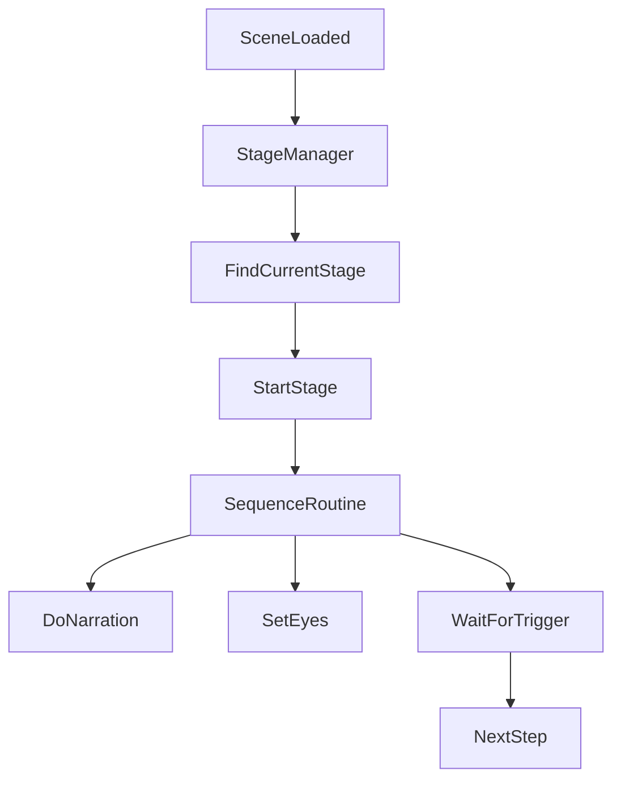

# Stage Sequence System

Related classes: [Stage](../classes/Stage.md), [Stage1](../classes/Stage1.md), [StageManager](../classes/StageManager.md), [GameManager](../classes/GameManager.md), [PostProcessingControl](../classes/PostProcessingControl.md), [SoundManager](../classes/SoundManager.md)

## Problem

DualMind는 내레이션을 중심으로 진행되는 퍼즐 게임입니다. 내레이션이 끝나는 시점, 화면 암전/개안, 입력 잠금, 퍼즐 완료 Trigger, 다음 씬 이동이 서로 다른 스크립트에 흩어지면 진행 순서가 쉽게 꼬일 수 있습니다.

특히 Stage1은 여러 감정 테마의 미로를 반복 생성하고, 각 미로마다 내레이션과 입력 가능 상태를 조절한 뒤, 플레이어가 목표를 찾을 때까지 기다려야 했습니다.

## What I Wanted

- 스테이지마다 다른 진행 흐름은 유지하되, 공통 제어 기능은 한 곳에 모으고 싶었습니다.
- 내레이션, 화면 전환, 입력 상태, 퍼즐 완료 대기를 코드상에서 순서대로 읽히게 만들고 싶었습니다.
- 퍼즐이 완료되면 다음 시퀀스로 넘어가는 구조를 명확하게 만들고 싶었습니다.

## Solution

`Stage` 추상 클래스를 만들고, 각 스테이지가 `SequenceRoutine()` 코루틴을 구현하도록 구성했습니다.

## Implementation

- `StageManager`는 씬 로드 후 현재 씬의 `Stage`를 찾아 `StartStage()`를 호출합니다.
- `Stage.StartStage()`는 스테이지별 `SequenceRoutine()`을 실행합니다.
- `Stage.DoNarration()`은 AudioClip 길이만큼 기다려 내레이션과 진행 타이밍을 맞춥니다.
- `Stage.SetEyes()`는 화면 페이드와 입력 가능 상태를 함께 제어합니다.
- `Stage.WaitForTrigger()`는 퍼즐 오브젝트나 Gate가 `Trigger()`를 호출할 때까지 대기합니다.

## Result

스토리 진행과 퍼즐 진행을 코루틴 순서대로 읽을 수 있게 되었고, 스테이지별 진행 흐름을 `Intro`, `Stage1`, `Stage2`, `Stage3`, Ending 클래스로 나눌 수 있었습니다.

## What I Would Improve

- 현재 `Stage1`의 시퀀스는 직접 작성된 흐름이 길어졌기 때문에, 반복되는 내레이션-미로-Trigger 패턴을 데이터 기반 구조로 바꿀 수 있습니다.
- 디버그 입력과 하드코딩된 대기 시간은 별도 설정 값으로 분리하는 것이 좋습니다.
- `SequenceStepSO`를 활용해 내레이션, 화면 전환, 입력 잠금 같은 시퀀스 단계를 ScriptableObject 기반으로 일반화할 수 있습니다.
