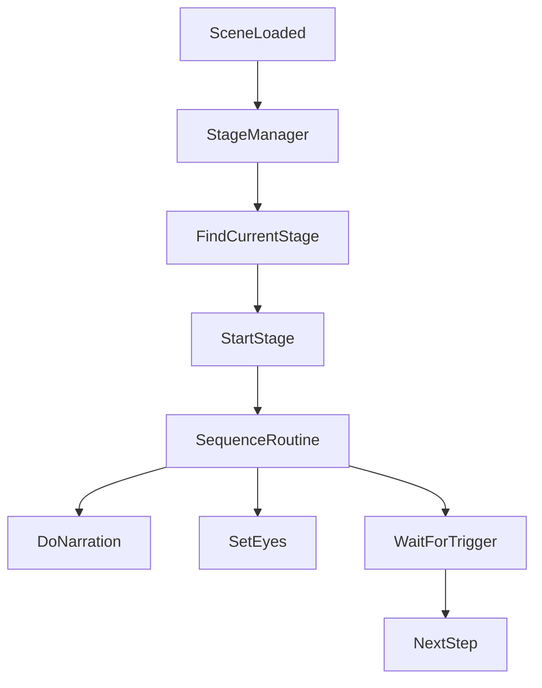

# Stage Sequence System

Related classes: [Stage](../classes/Stage.md), [Stage1](../classes/Stage1.md), [StageManager](../classes/StageManager.md), [GameManager](../classes/GameManager.md), [PostProcessingControl](../classes/PostProcessingControl.md), [SoundManager](../classes/SoundManager.md)

## Problem

DualMind는 내레이션을 중심으로 진행되는 퍼즐 게임입니다. 제가 해결하려던 문제는 진행 자체는 절차적으로 통제하되, 각 스테이지가 자기만의 퍼즐·연출을 가질 수 있게 만드는 일이었습니다. 스테이지를 하나씩 독립적으로 구현하면 내레이션 종료, 화면 암전/개안, 입력 잠금, 퍼즐 완료 Trigger, 다음 씬 이동의 공통 흐름이 쉽게 흩어질 수 있습니다.

특히 Stage1은 여러 감정 테마의 미로를 반복 생성하고, 각 미로마다 내레이션과 입력 가능 상태를 조절한 뒤, 플레이어가 목표를 찾을 때까지 기다려야 했습니다.

## What I Wanted

- 스테이지마다 다른 진행 흐름은 유지하되, 공통 제어 기능은 한 곳에 모으고 싶었습니다.
- 내레이션, 화면 전환, 입력 상태, 퍼즐 완료 대기를 코드상에서 순서대로 읽히게 만들고 싶었습니다.
- 퍼즐이 완료되면 다음 시퀀스로 넘어가는 구조를 명확하게 만들고 싶었습니다.

## Solution

공통 제어를 `Stage` 추상 클래스에 두고, 각 스테이지가 가상 `SequenceRoutine()` 코루틴과 필요한 고유 함수를 구현하도록 구성했습니다. 당시에는 공통 흐름을 빠르게 유지하면서 스테이지별 요구를 담기에 적합한 선택이었습니다.

```mermaid
flowchart TD
    SceneLoaded --> StageManager
    StageManager --> FindCurrentStage
    FindCurrentStage --> StartStage
    StartStage --> SequenceRoutine
    SequenceRoutine --> DoNarration
    SequenceRoutine --> SetEyes
    SequenceRoutine --> WaitForTrigger
    WaitForTrigger --> NextStep
```

## Implementation

- `StageManager`는 씬 로드 후 현재 씬의 `Stage`를 찾아 `StartStage()`를 호출합니다.
- `Stage.StartStage()`는 스테이지별 `SequenceRoutine()`을 실행합니다.
- `Stage.DoNarration()`은 AudioClip 길이만큼 기다려 내레이션과 진행 타이밍을 맞춥니다.
- `Stage.SetEyes()`는 화면 페이드와 입력 가능 상태를 함께 제어합니다.
- `Stage.WaitForTrigger()`는 퍼즐 오브젝트나 Gate가 `Trigger()`를 호출할 때까지 대기합니다.

## Result

스토리 진행과 퍼즐 진행을 코루틴 순서대로 읽을 수 있게 되었고, `Intro`, `Stage1`, `Stage2`, `Stage3`, Ending이 같은 시작·대기·전환 규칙을 공유하면서도 각자 필요한 흐름을 구현할 수 있었습니다.

## What I Would Improve

- 공통 흐름을 상속으로 묶은 대신 `Stage1`처럼 절차가 길어지는 클래스가 생겼고, 새로운 독립 시스템을 붙일 때 Stage를 더 수정해야 하는 한계가 있었습니다. 반복되는 내레이션-미로-Trigger 패턴은 기믹 단위 모듈이나 데이터 기반 구조로 분리할 수 있습니다.
- 디버그 입력과 하드코딩된 대기 시간은 별도 설정 값으로 분리하는 것이 좋습니다.
- `SequenceStepSO`를 활용해 내레이션, 화면 전환, 입력 잠금 같은 시퀀스 단계를 ScriptableObject 기반으로 일반화할 수 있습니다.
