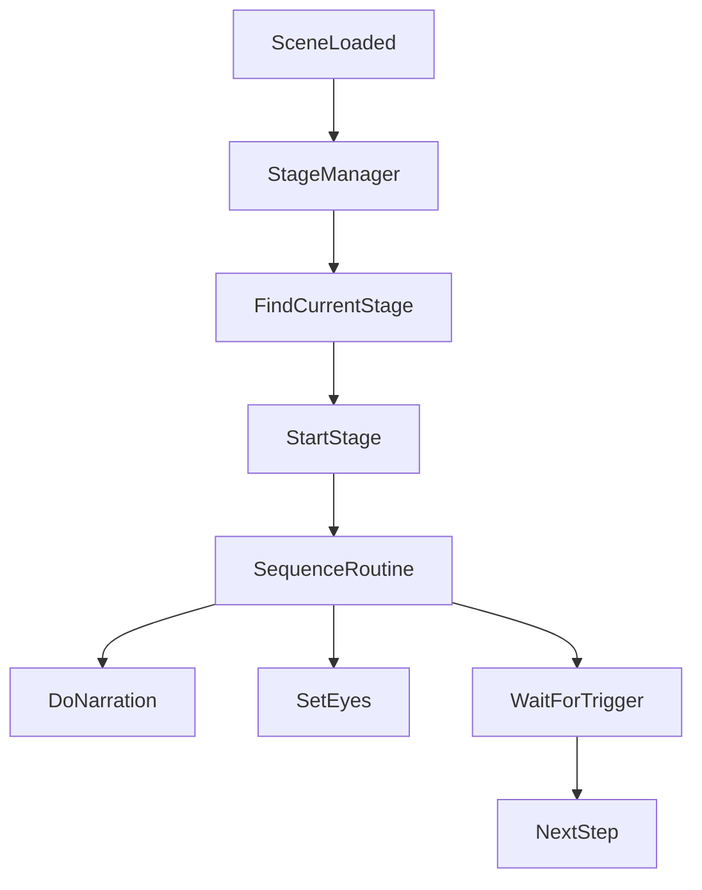

# Stage Sequence System

Related classes: [Stage](../classes/Stage.md), [Stage1](../classes/Stage1.md), [StageManager](../classes/StageManager.md), [GameManager](../classes/GameManager.md), [PostProcessingControl](../classes/PostProcessingControl.md), [SoundManager](../classes/SoundManager.md)

## 왜 이 구조가 필요했는가

DualMind는 내레이션을 따라 이야기가 진행되고, 플레이어가 필요한 순간에만 직접 퍼즐을 푸는 게임입니다. 그래서 제가 먼저 해결해야 했던 일은 “다음 내레이션을 언제 재생할지”와 “언제 플레이어를 움직이게 할지”, “퍼즐이 끝나면 어떻게 다음 장면으로 넘길지”를 하나의 흐름으로 묶는 것이었습니다.

특히 Stage1은 여러 감정 테마의 미로를 반복 생성하고, 각 미로마다 내레이션과 입력 가능 상태를 조절한 뒤, 플레이어가 목표를 찾을 때까지 기다려야 했습니다.

## 당시 선택

- 스테이지마다 다른 진행 흐름은 유지하되, 공통 제어 기능은 한 곳에 모으고 싶었습니다.
- 내레이션, 화면 전환, 입력 상태, 퍼즐 완료 대기를 코드상에서 순서대로 읽히게 만들고 싶었습니다.
- 퍼즐이 완료되면 다음 시퀀스로 넘어가는 구조를 명확하게 만들고 싶었습니다.

## 구현: `Stage` 상속과 코루틴

공통 제어를 `Stage` 추상 클래스에 두고, 각 스테이지가 `SequenceRoutine()` 코루틴을 구현하게 했습니다. 씬이 열리면 `StageManager`가 현재 `Stage`를 찾아 시작하고, 각 스테이지는 자신에게 필요한 퍼즐과 연출을 순서대로 실행합니다. 3주 안에 처음부터 엔딩까지 플레이 가능한 흐름을 완성해야 했던 당시에는, 공통 흐름을 유지하면서 각 퍼즐의 차이를 담기 위한 현실적인 선택이었습니다.

```mermaid
flowchart TD
    SceneLoaded --> StageManager
    StageManager --> FindCurrentStage
    FindCurrentStage --> StartStage
    StartStage --> SequenceRoutine
    SequenceRoutine --> DoNarration
    SequenceRoutine --> SetEyes
    SequenceRoutine --> WaitForTrigger
    WaitForTrigger --> NextStep
```

## 코드에서 확인할 수 있는 흐름

- `StageManager`는 씬 로드 후 현재 씬의 `Stage`를 찾아 `StartStage()`를 호출합니다.
- `Stage.StartStage()`는 스테이지별 `SequenceRoutine()`을 실행합니다.
- `Stage.DoNarration()`은 AudioClip 길이만큼 기다려 내레이션과 진행 타이밍을 맞춥니다.
- `Stage.SetEyes()`는 화면 페이드와 입력 가능 상태를 함께 제어합니다.
- `Stage.WaitForTrigger()`는 퍼즐 오브젝트나 Gate가 `Trigger()`를 호출할 때까지 대기합니다.

## 이 방식으로 가능했던 것

`Intro`, `Stage1`, `Stage2`, `Stage3`, Ending이 같은 시작·대기·전환 규칙을 공유하면서도, 각자 필요한 미로·구 점등·다리·대결의 순서를 구현할 수 있었습니다. 특히 `WaitForTrigger()`는 퍼즐이 완료될 때까지 진행을 멈추게 해, 내레이션만 끝나면 다음 장면으로 넘어가는 흐름을 피하는 데 사용했습니다.

## 남은 한계와 다시 설계한다면

- 상속과 코루틴은 빠르게 순서를 만드는 데는 유효했지만, `Stage1`처럼 `WaitForSeconds`, Trigger 대기, 입력 차단 호출이 한 클래스에 길게 쌓였습니다.
- 조작을 막는 일을 시퀀스마다 직접 호출하지 않고, `GameState`가 현재 상태를 바꾸면 입력·UI·화면 연출이 그 상태를 구독하게 만드는 편이 더 명확합니다.
- 문을 열거나 퍼즐을 해결한 플레이어 행동을 이벤트로 발행하고, 스테이지는 다음 이벤트를 기다리는 형태로 바꾸면 새로운 퍼즐을 붙일 때 기존 진행 코드를 덜 건드릴 수 있습니다.
